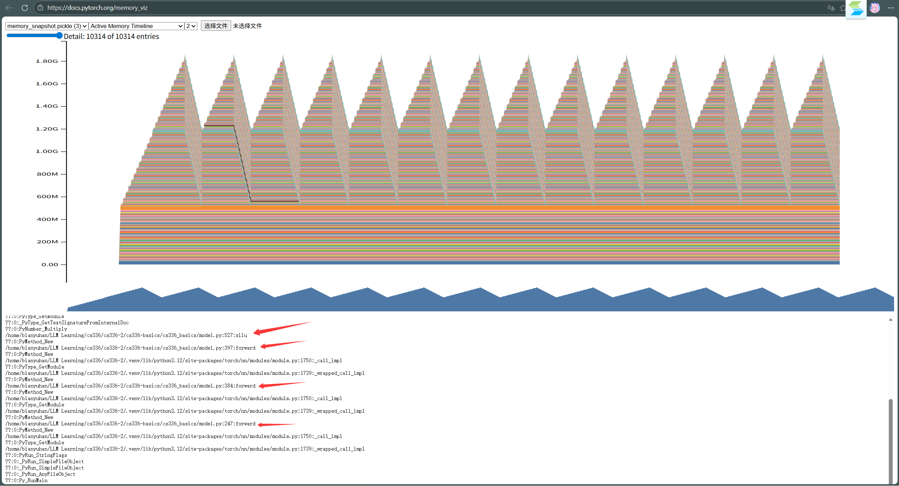

```python
MODEL_CONFIGS = {
    "small": dict(d_model=768, d_ff=3072, num_layers=12, num_heads=12),
    "medium": dict(d_model=1024, d_ff=4096, num_layers=24, num_heads=16),
    "large": dict(d_model=1280, d_ff=5120, num_layers=36, num_heads=20),
    "xl": dict(d_model=1600, d_ff=6400, num_layers=48, num_heads=25),
    "2.7b": dict(d_model=2560, d_ff=10240, num_layers=32, num_heads=32),
}
```

# 1、端到端基准测试实验：
### 模型推理/训练性能测试结果
| 模型尺寸 | 操作类型          | 是否使用Compile | 均值(ms) | 标准差(ms) |
|----------|-------------------|-----------------|----------|------------|
| small    | forward+backward  | 否              | 38.44    | 0.14       |
| medium   | forward+backward  | 否              | 110.16   | 0.08       |
| large    | forward+backward  | 否              | 221.07   | 0.19       |
| xl       | forward+backward  | 否              | 447.25   | 0.39       |
| 2.7b     | forward+backward  | 否              | 680.90   | 0.63       |
| small    | forward-only      | 否              | 18.34    | 1.30       |
| medium   | forward-only      | 否              | 36.30    | 0.13       |
| large    | forward-only      | 否              | 70.29    | 0.21       |
| xl       | forward-only      | 否              | 144.03   | 0.62       |
| 2.7b     | forward-only      | 否              | 222.46   | 0.25       |
| small    | forward+backward  | 是              | 32.20    | 2.19       |
| medium   | forward+backward  | 是              | 96.29    | 0.48       |
| large    | forward+backward  | 是              | 201.70   | 0.68       |
| xl       | forward+backward  | 是              | 414.44   | 0.71       |
| 2.7b     | forward+backward  | 是              | 652.06   | 1.34       |
| small    | forward-only      | 是              | 9.33     | 4.23       |
| medium   | forward-only      | 是              | 32.53    | 2.88       |
| large    | forward-only      | 是              | 62.96    | 1.99       |
| xl       | forward-only      | 是              | 130.94   | 0.25       |
| 2.7b     | forward-only      | 是              | 212.69   | 0.34       |

### 总结
1. `torch.compile` 对所有模型尺寸的操作均有加速效果，其中small模型的forward-only加速最显著（从18.34ms降至9.33ms）；
2. 模型尺寸越大，forward+backward的耗时增长越明显，且标准差整体随模型尺寸增大略有上升；
3. 使用compile后，部分场景（如small模型）的标准差有所增大，可能是编译优化的动态特性导致的小幅波动。

# 2、nsys实验
由于使用的服务器并没有安装，也没有root权限，只能遗憾跳过该部分。


# 3、精度实验
运行以下代码：
```python
import torch

s = torch.tensor(0,dtype=torch.float32)
for i in range(1000): 
    s += torch.tensor(0.01,dtype=torch.float32)
print(s)

s = torch.tensor(0,dtype=torch.float16)
for i in range(1000):
    s += torch.tensor(0.01,dtype=torch.float16)
print(s) 

s = torch.tensor(0,dtype=torch.float32) 
for i in range(1000): 
    s += torch.tensor(0.01,dtype=torch.float16)
print(s)

s = torch.tensor(0,dtype=torch.float32) 
for i in range(1000):
    x = torch.tensor(0.01,dtype=torch.float16) 
    s += x.type(torch.float32)
print(s) 
```
得到输出结果如下：
```python
tensor(10.0001)
tensor(9.9531, dtype=torch.float16)
tensor(10.0021)
tensor(10.0021)
```
毫无疑问，完全使用f32的计算精度是最高的。而将f16转换成f32的精度损失相比完全使用f16的精度也还是更高一些。

# 4、混合精度实验
运行以下代码，使用autocast指定运算精度为bf16。观察哪些部分被转换成bf16了，哪些仍然是f32：
```python
class ToyModel(nn.Module):
    def __init__(self, in_features: int, out_features: int):
        super().__init__()
        self.fc1 = nn.Linear(in_features, 10, bias=False)
        self.ln = nn.LayerNorm(10)
        self.fc2 = nn.Linear(10, out_features, bias=False)
        self.relu = nn.ReLU()
    def forward(self, x):
        print(f'fc1 weight : {self.fc1.weight.dtype}')
        print(f'ln weight : {self.ln.weight.dtype}')
        print(f'fc2 weight : {self.fc2.weight.dtype}')
        x = self.relu(self.fc1(x))
        print('fc1 后', x.dtype)
        x = self.ln(x)
        print('ln 后', x.dtype)
        x = self.fc2(x)
        print('fc2 后', x.dtype)
        return x
criterion = nn.MSELoss()
model = ToyModel(4, 4).to('cuda')
x = torch.rand(4, 4, dtype=torch.float32).to('cuda')
with torch.autocast(device_type='cuda', dtype=torch.bfloat16):
    y = model(x)
    target = torch.zeros_like(y)
    loss = criterion(y, target)
    print('loss dtype:', loss.dtype)
    loss.backward()
    print('fc1.grad dtype:', model.fc1.weight.grad.dtype)
    print('ln.grad dtype:', model.ln.weight.grad.dtype)
    print('fc2.grad dtype:', model.fc2.weight.grad.dtype)
```

结果如下：
```python
fc1 weight : torch.float32
ln weight : torch.float32
fc2 weight : torch.float32
fc1 后 torch.bfloat16
ln 后 torch.float32
fc2 后 torch.bfloat16
loss dtype: torch.float32
fc1.grad dtype: torch.float32
ln.grad dtype: torch.float32
fc2.grad dtype: torch.float32
```
观察结论可以发现，AMP（autocast）只降低“算子内部计算和激活”的精度，不降低“参数、归一化、loss、梯度”的精度。
在执行线性层的时候（矩阵乘法这种计算密集型算子）时，autocast进行精度转换，包括激活后的类型也是转换后的精度：
```python
x(fp32) × W(fp32)
  ↓ autocast
x(bf16) × W(bf16) → output(bf16)
```
而在layerNorm这种数值敏感算子会强制回退到 float32 计算，并输出 float32 激活。

# 5、内存实验
仅forward：

可以看到每次forward时抵达一次波峰，有过多少次forward就有多少次波峰

forward + backward：

这条记录对应的是：在 backward 阶段，为参数创建 / 累积梯度（.grad）而进行的一次 CUDA 内存分配。
具体而言，在反向传播过程中，autograd 引擎执行到某个参数的 AccumulateGrad 节点时，发现该参数的 .grad 还不存在，于是调 empty_strided_cuda 在 GPU 上分配了一块约 29.3MiB 的连续显存，用于存储该参数的梯度，并将后续反向传播计算得到的梯度累加到该 buffer 中。

从 CUDA 内存时间线可以观察到，模型训练过程中显存使用呈现稳定的周期性锯齿结构。每个训练迭代中，前向传播阶段逐步分配中间激活，反向传播阶段达到显存峰值，随后在梯度计算完成后显存回落。整体显存基线保持稳定，未出现持续增长，表明不存在显著的内存泄漏问题。


# 6、原始Attention | pytorch实现FlashAttention | Triton实现FlashAttention 性能比较
| T | D | dtype | PT fwd (ms) | PT bwd (ms) | PT fwd+bwd (ms) | TR fwd (ms) | TR bwd (ms) | TR fwd+bwd (ms) | Naive fwd (ms) | Naive bwd (ms) | Naive fwd+bwd (ms) |
|---|---|-------|----|----|----|----|----|----|----|----|----|
| 128 | 16 | bfloat16 | 8.445 | 0.103 | 9.405 | 0.011 | 0.181 | 0.553 | 0.034 | 0.164 | 0.573 |
| 128 | 16 | float32 | 8.677 | 0.265 | 9.294 | 0.010 | 0.362 | 0.591 | 0.042 | 0.148 | 0.572 |
| 128 | 32 | bfloat16 | 8.586 | 0.272 | 9.415 | 0.012 | 0.383 | 0.598 | 0.040 | 0.149 | 0.577 |
| 128 | 32 | float32 | 8.511 | 0.293 | 9.292 | 0.012 | 0.357 | 0.585 | 0.042 | 0.149 | 0.599 |
| 256 | 16 | bfloat16 | 32.762 | 0.267 | 33.762 | 0.015 | 0.382 | 0.602 | 0.042 | 0.159 | 0.592 |
| 256 | 16 | float32 | 32.770 | 0.272 | 33.612 | 0.014 | 0.370 | 0.631 | 0.044 | 0.152 | 0.569 |
| 256 | 32 | bfloat16 | 34.085 | 0.278 | 34.004 | 0.017 | 0.377 | 0.607 | 0.041 | 0.160 | 0.601 |
| 256 | 32 | float32 | 33.080 | 0.278 | 33.762 | 0.018 | 0.355 | 0.594 | 0.046 | 0.161 | 0.579 |

可以看见，使用Triton实现的FlashAttention Forward性能显著优于pytorch实现与原Attention实现
可以预见，使用Triton实现FlashAttention 的 Backward，性能也能大幅优化，本项目不进行实现，有机会来完成。

# 7、Final: 完成了本项目中的并行部分，实现了 DDP 和 Bucket DDP
这些内容有对应的pytest测试用例，完全通过。
（优化器状态分片未写，有机会来完成）